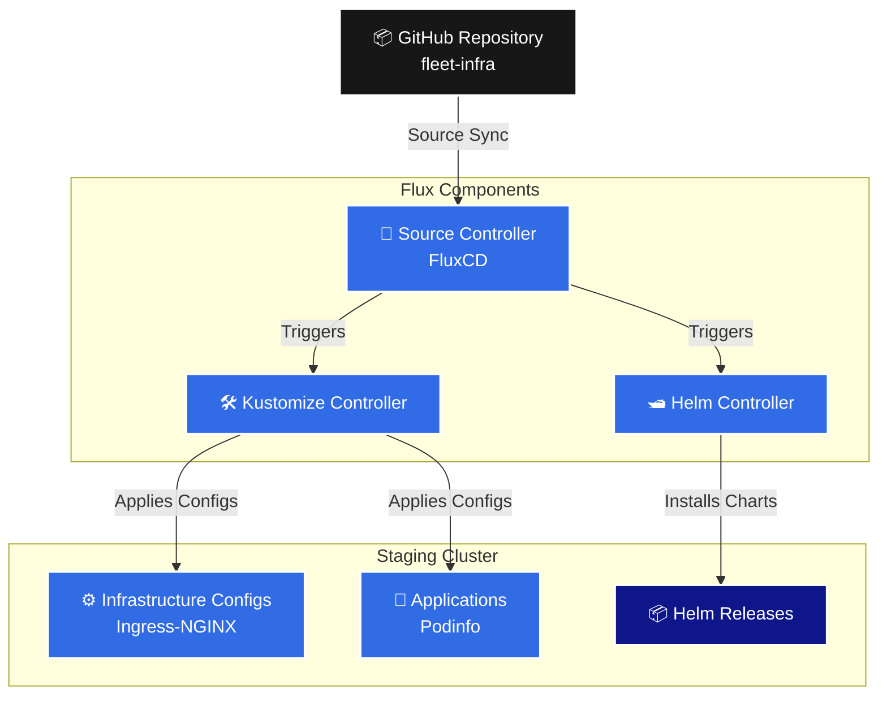

# 🚀 Fleet Infrastructure with FluxCD

Welcome to the `fleet-infra` repository! This repository uses **FluxCD** (GitOps) to manage the state, infrastructure, and applications of our Kubernetes clusters in a declarative and automated manner.

## 🏗️ Architecture

FluxCD monitors this repository and continuously reconciles the state of our Kubernetes clusters to match the configurations defined here.



## 📂 Repository Structure

Our GitOps directory is structured into three main logical components: **Clusters**, **Infrastructure**, and **Apps**.

```text
fleet-infra/
├── apps/                        # Application configurations
│   ├── base/                    # Base manifests (common to all environments)
│   │   └── podinfo/             # Podinfo deployment & service manifests
│   ├── production/              # Production-specific overlays
│   └── staging/                 # Staging-specific overlays (e.g., replica count)
│
├── clusters/                    # Cluster-specific definitions
│   └── staging/                 
│       ├── apps.yml             # Points Flux to deploy /apps/staging
│       ├── infrastructure.yml   # Points Flux to deploy /infrastructure
│       └── flux-system/         # Core FluxCD components for the cluster
│
└── infrastructure/              # Shared Infrastructure (Controllers, CRDs)
    └── controllers/             
        ├── ingress-nginx.yml    # NGINX Ingress Controller HelmRelease
        └── kustomization.yaml   # Kustomization for infrastructure components
```

### 1. Clusters (`/clusters`)
The entry point for Flux. When Flux bootstraps a cluster, it reads from the specific directory inside `/clusters/` (e.g., `/clusters/staging`). This directory contains sync files (`apps.yml` and `infrastructure.yml`) that tell Flux where to find the rest of the infrastructure and application manifests.

### 2. Infrastructure (`/infrastructure`)
Contains critical cluster infrastructure that needs to be deployed *before* applications. This includes tools like:
- Ingress Controllers (NGINX)
- Monitoring Tools (Prometheus, Grafana)
- Certificate Managers (cert-manager)

### 3. Applications (`/apps`)
Contains the actual workloads and microservices running on the cluster. We use Kustomize to manage different environments:
- **`base/`**: The core manifests (Deployments, Services) that remain the same across all environments.
- **`staging/` & `production/`**: Overlays that patch the base manifests with environment-specific settings (e.g., changing replicas, modifying resource limits, or injecting environment variables).

## 🚀 Getting Started

To sync this repository with your Kubernetes cluster, make sure you have the Flux CLI installed, then run the bootstrap command:

```bash
export GITHUB_USER=<your-github-username>
export GITHUB_TOKEN=<your-personal-access-token>

flux bootstrap github \
  --owner=$GITHUB_USER \
  --repository=fleet-infra \
  --branch=main \
  --path=clusters/staging \
  --personal
```

### Checking Sync Status

You can monitor the reconciliation process using the Flux CLI:

```bash
# Check the status of the Git repository source
flux get sources git

# Check the status of all Kustomizations (apps and infrastructure)
flux get kustomizations --watch

# Check the status of Helm Releases
flux get helmreleases -A
```

## 🛠️ Modifying the State

Because this is a GitOps repository, **do not manually run `kubectl apply`**. Instead, simply make your changes to the YAML files, commit them, and push them to the `main` branch. Flux will automatically detect the changes and apply them to the cluster within a few minutes!
